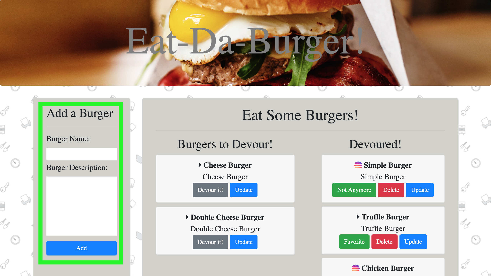
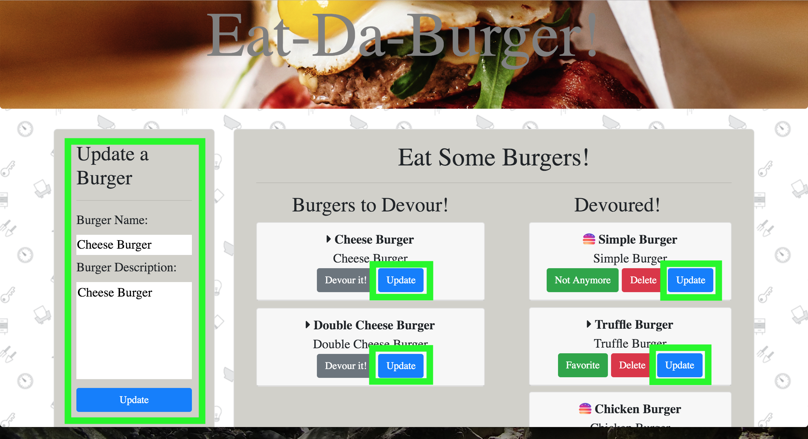
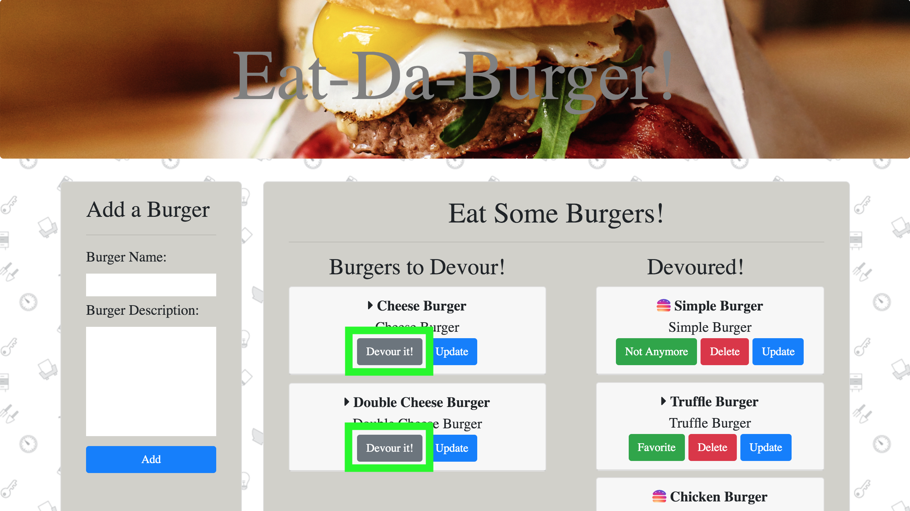
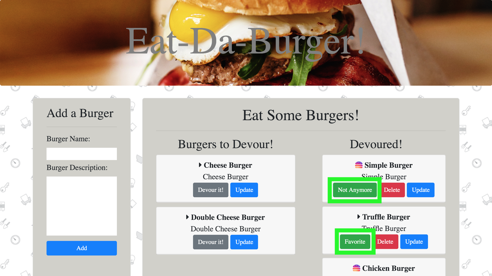
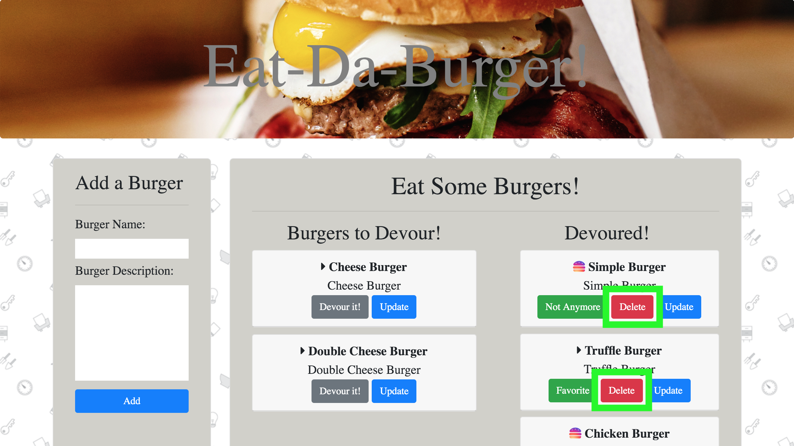

# burger
Eat-Da-Burger! Homework

Eat-Da-Burger! is a restaurant app that lets users input the names of burgers they'd like to eat. This application is a burger logger with MySQL, Node, Express, Handlebars and a homemade ORM (yum!) deployed in Heroku. It follows the MVC design pattern; uses Node and MySQL to query and route data in your app, and Handlebars to generate the HTML. The app will store every burger in a database, whether devoured or not.

### How to Use:

The application has 2 sections -- the `Add/Update a Burger` section on the left and the `Eat Some Burgers!` section on the right. `Eat Some Burgers!` has 2 sub section. The first one is `Burgers to Devour!` which has the burgers that haven't been devoured while the `Devoured!` has the burgers that has been devoured.

1. Add a Burger
    - The section where user can add a burger. Just enter the name of the burger, description, then click the `Add` button. Whenever a user adds a burger's name and description, the app will display the burger on the `Burgers to Devour!` -- waiting to be devoured. Name and Description only accepts letters, numbers, and some special characters (!,.-).

    

2. Update a Burger
    - `Update` button is used to update/change each item's name and description. Once it is clicked, the burger data will show on the left side/section (`Update a Burger`). Name and Description only accepts letters, numbers, and some special characters (!,.-).

    

3. Devour a Burger
    - To devour a burger, click the `Devour It` that is on each burger item. The app will display the burger on the `Devoured!` section.

    

4. Add/Remove a Favorite Burger
    - To make a burger your favorite, click the `Favorite` button displayed on each burger. The favorites burguer will have a rainbow colored burger icon on the right side of it's name. Remove a burger to your favorites by clicking the `Not Anymore` button.

    

5. Delete a Burger
    - Delete a burger by clicking the `Delete` button on a specific burger item. This deletes the burger in the database.

    

- - -

The project is useful because it provides an example of languages/technologies I learned and show what I can do as a developer. This application Node.js with Handlebars, and Express, Bootstrap, HTML, and CSS that is deployed in Heroku and uses ORM and MVC.

For questions or concerns, please go to my website at carafelise.com or send an email at admin@carafelise.com. I maintain and developed this project.